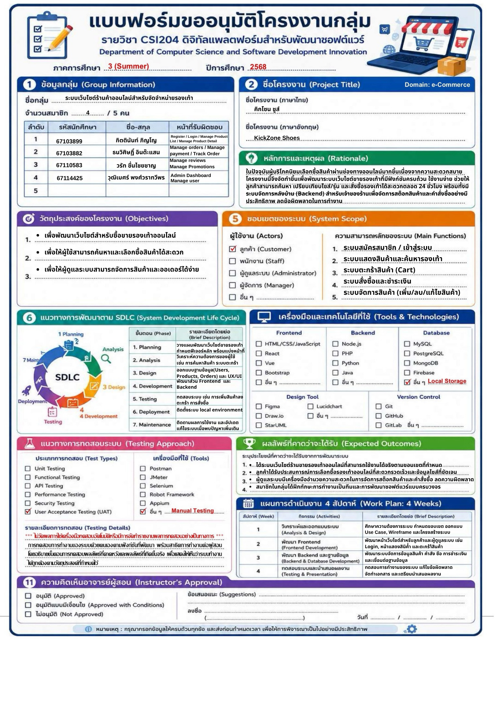

  

<h1 align="center">Kickzone Shoe (คิ๊กโซน)</h1>

<b>ระบบเว็บไซต์ร้านค้าออนไลน์สำหรับจัดจำหน่ายรองเท้า</b>

---

  

---

## โครงงานนี้คืออะไร

**Kick Zone (คิ๊กโซน)** ระบบเว็บไซต์ร้านค้าออนไลน์สำหรับจัดจำหน่ายรองเท้า
โดยระบบสามารถทำงานได้จริงทั้งหน้าบ้านและหลังบ้าน รองรับระบบสมาชิก มีระบบตะกร้าสินค้าและการสั่งซื้อสำหรับลูกค้าทั่วไป และมีระบบหลังบ้าน (Admin Dashboard) สำหรับให้แอดมินจัดการสินค้า (เพิ่ม ลด แก้ไข) และจัดการสถานะคำสั่งซื้อได้

จัดทำในรายวิชา **CSI204 - ดิจิทัลแพลตฟอร์มสำหรับพัฒนาซอฟต์แวร์**

**ทีมผู้จัดทำ**

| ลำดับ | รหัสนักศึกษา | ชื่อ-นามสกุล | ตำแหน่ง |
|:----:|:------------:|--------------|---------|
| 1 | 67103899 | กิตตินันท์ ภิญโญ | Project Manager |
| 2 | 67103882 | ธนวิศิษฏิ์ อินต๊ะแสน | Developer (Fullstack) |
| 3 | 67110583 | วรัท ชื่นไชยชาญ | Developer (Fullstack) |
| 4 | 67114425 | วุฒิเมศร์ พงศ์วราทวีพร | Developer (Fullstack) |

---

## 📋 สารบัญ

- [ภาพรวมโปรเจค](#ภาพรวมโปรเจค)
- [ฟีเจอร์หลัก](#ฟีเจอร์หลัก)
- [เทคโนโลยี (Tech Stack)](#เทคโนโลยี)
- [เอกสารประกอบโครงงาน](#เอกสารประกอบโครงงาน)

---

## 💻 ภาพรวมโปรเจค

**Kick Zone (คิ๊กโซน)** เป็นระบบ E-Commerce ที่ออกแบบมาสำหรับจัดจำหน่ายรองเท้าออนไลน์ โดยให้ลูกค้าสามารถ:

- ค้นหาและดูรายละเอียดของรองเท้าแบรนด์ต่างๆ
- หยิบสินค้าใส่ตะกร้าและดำเนินการสั่งซื้อ
- ติดตามสถานะคำสั่งซื้อของตนเอง

ทั้งนี้ **Admin (ผู้ดูแลระบบ)** สามารถเข้ามาจัดการเพิ่ม ลด แก้ไข ข้อมูลสินค้าในระบบ อัปเดตสถานะการจัดส่ง และดูภาพรวมยอดขายผ่าน Dashboard ได้แบบ Real-time

---

## ✨ ฟีเจอร์หลัก

### 👤 สำหรับลูกค้า (Customer)
- ✅ ค้นหาและเลือกดูสินค้ารองเท้าตามแบรนด์
- ✅ สมัครสมาชิก และเข้าสู่ระบบ
- ✅ ดูรายละเอียดสินค้า ราคา และรูปภาพ
- ✅ เพิ่มสินค้าลงตะกร้า (Shopping Cart)
- ✅ ยืนยันการสั่งซื้อสินค้า (Checkout)
- ✅ ดูประวัติการสั่งซื้อของตนเอง

### 🔧 สำหรับผู้ดูแลระบบ (Admin)
- ✅ Dashboard สรุปยอดขายรวม จำนวนออเดอร์ และจำนวนสินค้าในระบบ
- ✅ เพิ่ม / ลบ / แก้ไข ข้อมูลสินค้า (ชื่อ, แบรนด์, ราคา, รูปภาพ)
- ✅ ดูรายการคำสั่งซื้อทั้งหมดจากลูกค้า
- ✅ เปลี่ยนสถานะคำสั่งซื้อ (รอชำระเงิน -> กำลังจัดเตรียมสินค้า -> จัดส่งแล้ว)

---

## 🛠️ เทคโนโลยี (Tech Stack)

**Frontend (ส่วนหน้าบ้าน):**
- **React.js (Vite):** สำหรับพัฒนาส่วนติดต่อผู้ใช้งาน (UI) ให้ทำงานได้รวดเร็ว
- **React Router DOM:** สำหรับจัดการการเปลี่ยนหน้าเว็บ (Routing)
- **Bootstrap:** สำหรับตกแต่งความสวยงามและทำให้เว็บรองรับทุกขนาดหน้าจอ (Responsive)

**Backend (ส่วนหลังบ้าน):**
- **Node.js & Express.js:** สำหรับสร้าง RESTful API และจัดการการทำงานของเซิร์ฟเวอร์
- **pg (node-postgres):** สำหรับเชื่อมต่อและจัดการฐานข้อมูล

**Database (ฐานข้อมูล):**
- **PostgreSQL (Neon):** ระบบฐานข้อมูลเชิงสัมพันธ์แบบ Cloud (Cloud Database)

---

## เอกสารประกอบโครงงาน

| เอกสาร | เนื้อหา |
|--------|---------|
| [docs/analysis-design.md](./docs/analysis-design.md) | เอกสารวิเคราะห์และออกแบบ: Persona · Use Case · Class · Sequence · Architecture |
| [docs/architecture.md](./docs/architecture.md) | กระบวนการสถาปัตยกรรมระบบ (System Architecture) |
| [Wireframe (Figma)](https://www.figma.com/proto/jDeU44CwqFDEpHVFQV9PWt/KickZone-Sports?node-id=0-1&t=Iy4DsgZlU4ssWWsK-1) | ออกแบบ Wireframe (หน้าหลัก, รายการสินค้า, รายละเอียดสินค้า, ตะกร้า, Checkout/ชำระเงิน) ผ่าน Figma |

---

## 📞 ติดต่อ | Contact
 
**GitHub:** [KittinunPinyo](https://github.com/KittinunPinyo)

---

© 2026 KickZone (คิ๊กโซน) · โครงงานรายวิชา CSI204
