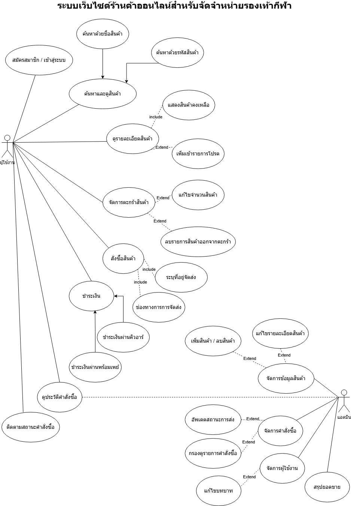
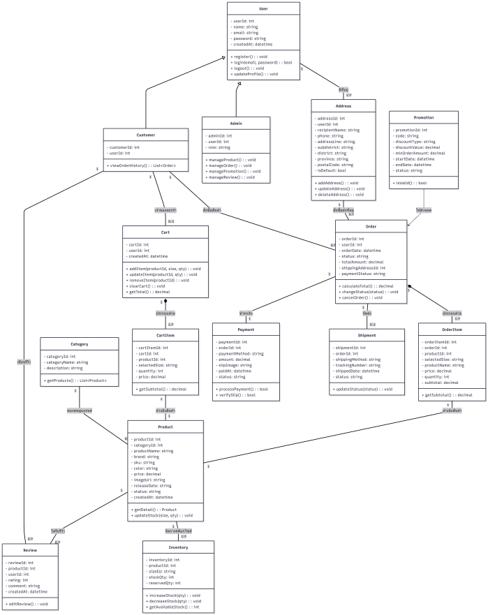
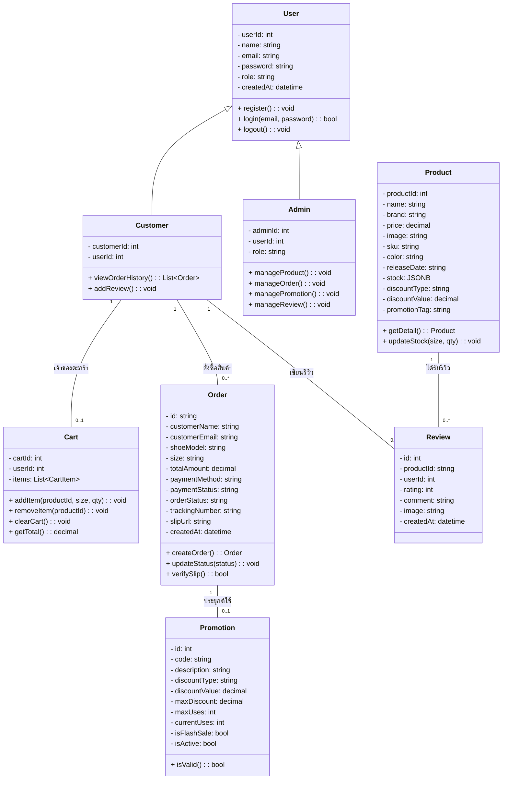
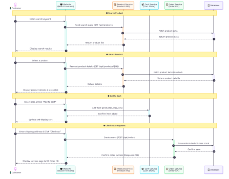
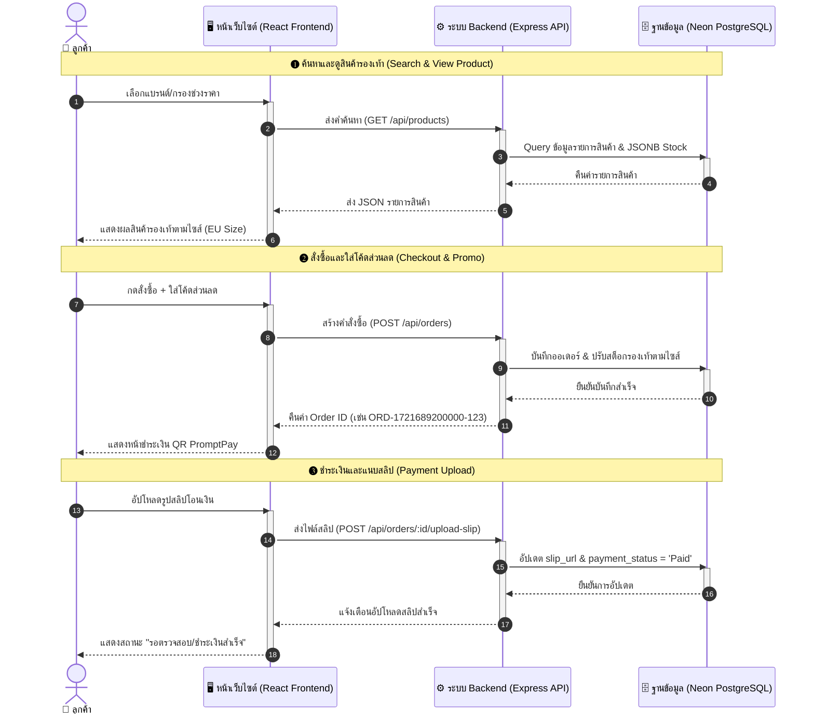

# เอกสารวิเคราะห์และออกแบบระบบ (Analysis & Design)
## โครงงาน: KickZone (คิ๊กโซน) - ระบบเว็บไซต์ร้านค้าออนไลน์สำหรับจัดจำหน่ายรองเท้า

---

## 📋 สารบัญ

- [1. การวิเคราะห์ความต้องการ (Requirements Analysis)](#1-การวิเคราะห์ความต้องการ-requirements-analysis)
  - [1.1 ความต้องการของผู้ใช้งาน (User Requirements)](#11-ความต้องการของผู้ใช้งาน-user-requirements)
  - [1.2 ขอบเขตของระบบ (System Scope)](#12-ขอบเขตของระบบ-system-scope)
- [2. แผนภาพยูสเคสและข้อกำหนด (Use Case Diagram & Specifications)](#2-แผนภาพยูสเคสและข้อกำหนด-use-case-diagram--specifications)
  - [2.1 แผนภาพยูสเคส (Use Case Diagram)](#21-แผนภาพยูสเคส-use-case-diagram)
  - [2.2 ตารางข้อกำหนดการใช้งานยูสเคส (Use Case Specifications Matrix)](#22-ตารางข้อกำหนดการใช้งานยูสเคส-use-case-specifications-matrix)
- [3. โครงสร้างคลาส (Class Diagram)](#3-โครงสร้างคลาส-class-diagram)
- [4. แผนภาพลำดับการทำงาน (Sequence Diagram)](#4-แผนภาพลำดับการทำงาน-sequence-diagram)
- [5. โครงสร้างข้อมูลและตัวอย่าง (JSON Schemas & Example Data)](#5-โครงสร้างข้อมูลและตัวอย่าง-json-schemas--example-data)
  - [5.1 User Schema & Example Data](#51-user-schema--example-data)
  - [5.2 Product Schema & Example Data](#52-product-schema--example-data)
  - [5.3 Order Schema & Example Data](#53-order-schema--example-data)
  - [5.4 Review Schema & Example Data](#54-review-schema--example-data)
  - [5.5 Promotion Schema & Example Data](#55-promotion-schema--example-data)

---

## 1. การวิเคราะห์ความต้องการ (Requirements Analysis)

### 1.1 ความต้องการของผู้ใช้งาน (User Requirements)

ระบบมีผู้ใช้งานหลัก 2 กลุ่ม คือ **ลูกค้า (Customer)** และ **ผู้ดูแลระบบ (Admin)**

**👤 ลูกค้า (Customer)**
* สมัครสมาชิก และเข้าสู่ระบบ (รองรับการเข้าสู่ระบบด้วยบัญชี Google OAuth)
* ค้นหา กรองช่วงราคา และเลือกดูสินค้ารองเท้าตามแบรนด์
* ดูรายละเอียดสินค้า โทนสี และตรวจสอบสต็อกแบบแยกตามไซส์ (EU Size)
* เพิ่มสินค้าลงตะกร้า (Shopping Cart) และบันทึกสินค้าที่ชอบ (Wishlist)
* ใช้งานโค้ดส่วนลด (Promo Code) และเข้าร่วมแคมเปญ Flash Sale
* ดำเนินการสั่งซื้อสินค้า (Checkout) พร้อมแนบหลักฐานการชำระเงิน (Upload Slip)
* ให้คะแนน (Rating) เขียนรีวิว และแนบรูปภาพสินค้าหลังการซื้อ
* ดูประวัติการสั่งซื้อ และติดตามสถานะพัสดุของตนเอง

**🔧 ผู้ดูแลระบบ (Admin)**
* ดูภาพรวมของระบบผ่าน Dashboard (สรุปยอดขาย, จำนวนคำสั่งซื้อ, จำนวนสินค้า)
* จัดการข้อมูลสินค้า (เพิ่ม/แก้ไข/ลบ ข้อมูลทั่วไป รูปภาพ และสต็อกสินค้าแยกตามไซส์)
* จัดการคำสั่งซื้อ (ตรวจสอบสลิปโอนเงิน, อัปเดตสถานะการจัดส่ง, และออกเลข Tracking อัตโนมัติ)
* จัดการโปรโมชั่น (สร้าง/แก้ไข/ลบ โค้ดส่วนลด, กำหนดสิทธิ์การใช้, และเปิดโหมด Flash Sale)
* จัดการรีวิว (ตรวจสอบข้อความ/รูปภาพ และลบรีวิวที่ไม่เหมาะสม)
* จัดการข้อมูลผู้ใช้งาน (ดูรายการผู้ใช้, ปรับเปลี่ยนบทบาท Customer/Admin, ลบผู้ใช้งาน)

### 1.2 ขอบเขตของระบบ (System Scope)

1. **ระบบจัดการสมาชิกและการยืนยันตัวตน**: ครอบคลุมการสมัครสมาชิก เข้าสู่ระบบ และการเชื่อมต่อผ่าน Google OAuth
2. **ระบบจัดการข้อมูลสินค้าและคลังสินค้า**: จัดการข้อมูลรองเท้าและระบบตัดสต็อกแบบเจาะจงตามไซส์ (EU Size)
3. **ระบบค้นหาและแสดงผลสินค้า**: ครอบคลุมการกรองสินค้าตามแบรนด์และราคา พร้อมแสดงรายละเอียดสินค้าที่ครบถ้วน
4. **ระบบตะกร้าสินค้าและรายการที่ชอบ**: การคำนวณราคาสินค้าในตะกร้า (Shopping Cart) และระบบ Wishlist
5. **ระบบสั่งซื้อและโปรโมชั่น**: การสร้างคำสั่งซื้อ การคำนวณส่วนลดจาก Promo Code และระบบ Flash Sale
6. **ระบบการชำระเงิน**: รองรับการยืนยันการสั่งซื้อผ่านการอัปโหลดหลักฐานการโอนเงิน (สลิปโอนเงิน)
7. **ระบบติดตามคำสั่งซื้อ**: การแสดงประวัติการสั่งซื้อและสถานะพัสดุสำหรับลูกค้า
8. **ระบบรีวิวสินค้า**: รองรับการให้คะแนนดาว เขียนความคิดเห็น และอัปโหลดรูปภาพรีวิวจากผู้ใช้งานจริง
9. **ระบบจัดการหลังบ้าน (Admin Panel)**: แผงควบคุมสำหรับผู้ดูแลระบบในการจัดการคำสั่งซื้อ สินค้า โปรโมชั่น รีวิว และแสดงรายงานสรุปผล (Dashboard)

---

## 2. แผนภาพยูสเคสและข้อกำหนด (Use Case Diagram & Specifications)

### 2.1 แผนภาพยูสเคส (Use Case Diagram)




---

### 2.2 ตารางข้อกำหนดการใช้งานยูสเคส (Use Case Specifications Matrix)

| รหัส Use Case | ชื่อ Use Case | ผู้ใช้งานหลัก (Actor) | คำอธิบาย (Description) | เงื่อนไขก่อนทำ (Pre-condition) | ผลลัพธ์หลังทำ (Post-condition) |
| :--- | :--- | :--- | :--- | :--- | :--- |
| **UC-01** | สมัครสมาชิก | ลูกค้า (Customer) | กรอกข้อมูลชื่อ อีเมล และรหัสผ่านเพื่อสร้างบัญชีผู้ใช้ใหม่ | ผู้ใช้ยังไม่มีบัญชีในระบบ | บัญชีผู้ใช้ถูกสร้างในฐานข้อมูล `users` |
| **UC-02** | เข้าสู่ระบบ | ลูกค้า / Admin | ยืนยันตัวตนด้วยอีเมลและรหัสผ่านเพื่อเข้าใช้งาน | มีบัญชีอยู่ในระบบแล้ว | ได้รับ JWT Token สำหรับใช้ในระบบ |
| **UC-03** | เข้าสู่ระบบด้วย Google | ลูกค้า (Customer) | ยืนยันตัวตนผ่านบัญชี Google OAuth 2.0 | มีบัญชี Google | ล็อกอินสำเร็จและสร้างบัญชีผู้ใช้ให้อัตโนมัติ |
| **UC-04** | ค้นหาและกรองรองเท้า | ผู้ใช้ทุกคน | ค้นหาตามชื่อรุ่น แบรนด์ (Nike, Adidas ฯลฯ) และช่วงราคา | อยู่ที่หน้า catalog สินค้า | แสดงรายการรองเท้าที่ตรงตามเงื่อนไข |
| **UC-05** | ดูรายละเอียดสินค้า & สต็อก | ผู้ใช้ทุกคน | ดูตารางไซส์ (EU 38-45) สต็อกคงเหลือ ราคา โปรโมชั่น | เลือกสินค้าที่ต้องการ | แสดงข้อมูลรายละเอียดสินค้าครบถ้วน |
| **UC-06** | จัดการตะกร้าสินค้า | ลูกค้า (Customer) | เพิ่ม/ลด/ลบ สินค้ารองเท้าและระบุไซส์ลงในตะกร้า | เข้าสู่ระบบ / เลือกสินค้า | ตะกร้าสินค้าปรับปรุงจำนวนและราคารวม |
| **UC-07** | บันทึกสินค้าที่ชอบ | ลูกค้า (Customer) | บันทึกรองเท้าที่สนใจเข้าสู่รายการ Wishlist | เข้าสู่ระบบเรียบร้อยแล้ว | สินค้าถูกบันทึกลงใน Wishlist ของผู้ใช้ |
| **UC-08** | สั่งซื้อสินค้า & ใช้โค้ดส่วนลด | ลูกค้า (Customer) | เลือกสินค้า สวมโค้ดส่วนลด คำนวณราคาสุทธิ และกดสั่งซื้อ | มีสินค้าในตะกร้า | สร้างรายการคำสั่งซื้อใหม่ (Status: Processing) |
| **UC-09** | อัปโหลดสลิปโอนเงิน | ลูกค้า (Customer) | แนบไฟล์รูปภาพสลิปโอนเงินผ่านระบบ PromptPay | สั่งซื้อสินค้าเรียบร้อย | อัปเดต `payment_status` และบันทึก `slip_url` |
| **UC-10** | ติดตามสถานะคำสั่งซื้อ | ลูกค้า (Customer) | เช็คสถานะคำสั่งซื้อ ตรวจสอบเลข พัสดุ (Tracking Number) | มีคำสั่งซื้อในระบบ | แสดงสถานะพัสดุและเลข Tracking TH-XXX |
| **UC-11** | เขียนรีวิวสินค้า | ลูกค้า (Customer) | ให้คะแนนดาว (1-5) เขียนความคิดเห็น และแนบรูปรีวิว | เคยสั่งซื้อสินค้านั้นแล้ว | รีวิวถูกบันทึกลงฐานข้อมูลและแสดงหน้าสินค้า |
| **UC-12** | ดู Dashboard | ผู้ดูแลระบบ (Admin) | ดูสรุปยอดขายรวม จำนวนออเดอร์ สินค้าขายดี | ล็อกอินด้วยสิทธิ์ Admin | แสดงรายงานข้อมูลแบบ Graph/KPI Dashboard |
| **UC-13** | จัดการสินค้าและสต็อก | ผู้ดูแลระบบ (Admin) | เพิ่ม แก้ไข ลบ รายการรองเท้า และปรับสต็อกตามไซส์ | ล็อกอินด้วยสิทธิ์ Admin | ข้อมูลสินค้าและสต็อกในฐานข้อมูลอัปเดต |
| **UC-14** | จัดการคำสั่งซื้อ & ตรวจสลิป | ผู้ดูแลระบบ (Admin) | ตรวจสอบรูปสลิปโอนเงินของลูกค้าและอนุมัติชำระเงิน | ล็อกอินด้วยสิทธิ์ Admin | อัปเดต `payment_status` เป็น Paid หรือ Rejected |
| **UC-15** | อัปเดตสถานะจัดส่ง | ผู้ดูแลระบบ (Admin) | ปรับสถานะพัสดุ และออกเลข Tracking Code | สลิปได้รับการอนุมัติ | ระบบสร้างเลข Tracking และเปลี่ยนสถานะ Shipping |
| **UC-16** | จัดการโปรโมชั่น & Flash Sale | ผู้ดูแลระบบ (Admin) | สร้างโค้ดส่วนลด กำหนดวันหมดอายุ และเปิด Flash Sale | ล็อกอินด้วยสิทธิ์ Admin | โค้ดส่วนลดและ Flash Sale มีผลในระบบ |
| **UC-17** | จัดการรีวิว | ผู้ดูแลระบบ (Admin) | ตรวจสอบความคิดเห็นลูกค้า และลบรีวิวที่ไม่เหมาะสม | ล็อกอินด้วยสิทธิ์ Admin | รีวิวที่ไม่เหมาะสมถูกลบออกจากระบบ |

---

## 3. โครงสร้างคลาส (Class Diagram)

ส่วนนี้แสดงโครงสร้างข้อมูล ความสัมพันธ์ระหว่าง Class (Relationships) และ Attributes/Methods ที่ใช้ในระบบจัดการร้านรองเท้า KickZone





---

## 4. แผนภาพลำดับการทำงาน (Sequence Diagram)

ส่วนนี้แสดงลำดับขั้นตอนการสื่อสารและทำงานร่วมกันของระบบต่างๆ ตั้งแต่การค้นหา สั่งซื้อ อัปโหลดสลิป จนถึงการอัปเดตสถานะ





---

## 5. โครงสร้างข้อมูลและตัวอย่าง (JSON Schemas & Example Data)

> [!NOTE]
> เอกสารฉบับเต็มของ JSON Schema (Draft-07 Standard) สามารถดูได้ที่ [docs/json-schema.json](./json-schema.json)

---

### 5.1 User Schema & Example Data

**JSON Schema (`User`):**
```json
{
  "$schema": "http://json-schema.org/draft-07/schema#",
  "title": "User",
  "type": "object",
  "properties": {
    "id": {
      "type": "integer",
      "description": "รหัสผู้ใช้"
    },
    "name": {
      "type": "string",
      "description": "ชื่อ-นามสกุล"
    },
    "email": {
      "type": "string",
      "format": "email",
      "description": "อีเมลผู้ใช้งาน"
    },
    "role": {
      "type": "string",
      "enum": ["customer", "admin"],
      "default": "customer",
      "description": "สิทธิ์การใช้งานระบบ"
    },
    "createdAt": {
      "type": "string",
      "format": "date-time",
      "description": "วันที่สมัครสมาชิก"
    }
  },
  "required": ["name", "email", "role"]
}
```

**ตัวอย่างข้อมูล JSON (JSON Example Payload):**
```json
{
  "id": 1,
  "name": "Kittinun Pinyo",
  "email": "customer@kickzone.com",
  "role": "customer",
  "createdAt": "2026-07-22T10:00:00.000Z"
}
```

---

### 5.2 Product Schema & Example Data

**JSON Schema (`Product`):**
```json
{
  "$schema": "http://json-schema.org/draft-07/schema#",
  "title": "Product",
  "type": "object",
  "properties": {
    "id": {
      "type": "integer",
      "description": "รหัสสินค้ารองเท้า"
    },
    "name": {
      "type": "string",
      "description": "ชื่อรุ่นรองเท้า"
    },
    "brand": {
      "type": "string",
      "description": "ชื่อแบรนด์รองเท้า (เช่น Nike, Adidas, Puma)"
    },
    "price": {
      "type": "number",
      "minimum": 0,
      "description": "ราคาปกติ (บาท)"
    },
    "image": {
      "type": "string",
      "description": "URL หรือพาธรูปภาพรองเท้า"
    },
    "sku": {
      "type": "string",
      "description": "รหัสสินค้า SKU"
    },
    "color": {
      "type": "string",
      "description": "โทนสีรองเท้า"
    },
    "releaseDate": {
      "type": "string",
      "description": "วันที่วางจำหน่าย"
    },
    "stock": {
      "type": "object",
      "description": "จำนวนสต็อกแยกตาม EU Size",
      "additionalProperties": {
        "type": "integer",
        "minimum": 0
      }
    },
    "discountType": {
      "type": "string",
      "enum": ["fixed", "percentage"],
      "default": "fixed",
      "description": "ประเภทส่วนลด"
    },
    "discountValue": {
      "type": "number",
      "minimum": 0,
      "default": 0,
      "description": "มูลค่าส่วนลด"
    },
    "promotionTag": {
      "type": "string",
      "description": "ป้ายโปรโมชั่น (เช่น Flash Sale, Hot Item)"
    }
  },
  "required": ["name", "price", "stock"]
}
```

**ตัวอย่างข้อมูล JSON (JSON Example Payload):**
```json
{
  "id": 101,
  "name": "Nike Air Force 1 '07",
  "brand": "Nike",
  "price": 3600,
  "image": "/uploads/nike-af1.jpg",
  "sku": "NK-AF1-001",
  "color": "White/White",
  "releaseDate": "2024-01-15",
  "stock": {
    "38": 10,
    "39": 5,
    "40": 0,
    "41": 8,
    "42": 12
  },
  "discountType": "percentage",
  "discountValue": 10,
  "promotionTag": "Flash Sale"
}
```

---

### 5.3 Order Schema & Example Data

**JSON Schema (`Order`):**
```json
{
  "$schema": "http://json-schema.org/draft-07/schema#",
  "title": "Order",
  "type": "object",
  "properties": {
    "id": {
      "type": "string",
      "description": "รหัสคำสั่งซื้อ (เช่น ORD-1721689200000-123)"
    },
    "customerName": {
      "type": "string",
      "description": "ชื่อผู้สั่งซื้อ"
    },
    "customerEmail": {
      "type": "string",
      "format": "email",
      "description": "อีเมลผู้สั่งซื้อ"
    },
    "shoeModel": {
      "type": "string",
      "description": "ชื่อรุ่นรองเท้าที่สั่งซื้อ"
    },
    "size": {
      "type": "string",
      "description": "ไซส์รองเท้า (EU Size)"
    },
    "totalAmount": {
      "type": "number",
      "minimum": 0,
      "description": "ยอดรวมสุทธิ (บาท)"
    },
    "paymentMethod": {
      "type": "string",
      "default": "PromptPay",
      "description": "ช่องทางการชำระเงิน"
    },
    "paymentStatus": {
      "type": "string",
      "enum": ["Pending Upload", "Paid", "Rejected", "Refunded"],
      "default": "Pending Upload",
      "description": "สถานะการตรวจสอบการชำระเงิน"
    },
    "orderStatus": {
      "type": "string",
      "enum": ["Processing", "Shipping", "Completed", "Cancelled"],
      "default": "Processing",
      "description": "สถานะการจัดส่งพัสดุ"
    },
    "trackingNumber": {
      "type": "string",
      "default": "N/A",
      "description": "หมายเลขพัสดุจัดส่ง"
    },
    "slipUrl": {
      "type": ["string", "null"],
      "description": "พาธไฟล์รูปสลิปโอนเงิน"
    },
    "createdAt": {
      "type": "string",
      "format": "date-time",
      "description": "เวลาที่สั่งซื้อ"
    }
  },
  "required": ["id", "customerName", "customerEmail", "shoeModel", "size", "totalAmount"]
}
```

**ตัวอย่างข้อมูล JSON (JSON Example Payload):**
```json
{
  "id": "ORD-1721689200000-123",
  "customerName": "Thanawisit Intasaen",
  "customerEmail": "customer@example.com",
  "shoeModel": "Adidas Ultraboost Light",
  "size": "42",
  "totalAmount": 4500,
  "paymentMethod": "PromptPay",
  "paymentStatus": "Paid",
  "orderStatus": "Shipping",
  "trackingNumber": "TH-89213",
  "slipUrl": "/uploads/slip-1721689200000.jpg",
  "createdAt": "2026-07-22T14:30:00.000Z"
}
```

---

### 5.4 Review Schema & Example Data

**JSON Schema (`Review`):**
```json
{
  "$schema": "http://json-schema.org/draft-07/schema#",
  "title": "Review",
  "type": "object",
  "properties": {
    "id": {
      "type": "integer",
      "description": "รหัสรีวิว"
    },
    "productId": {
      "type": "string",
      "description": "รหัสสินค้าที่ถูกรีวิว"
    },
    "userId": {
      "type": "integer",
      "description": "รหัสผู้เขียนรีวิว"
    },
    "userName": {
      "type": "string",
      "description": "ชื่อผู้รีวิว"
    },
    "rating": {
      "type": "integer",
      "minimum": 1,
      "maximum": 5,
      "description": "คะแนนดาว (1 - 5)"
    },
    "comment": {
      "type": "string",
      "description": "ข้อความความคิดเห็น"
    },
    "image": {
      "type": ["string", "null"],
      "description": "พาธรูปภาพแนบรีวิว"
    },
    "createdAt": {
      "type": "string",
      "format": "date-time",
      "description": "เวลาที่รีวิว"
    }
  },
  "required": ["productId", "userId", "rating", "comment"]
}
```

**ตัวอย่างข้อมูล JSON (JSON Example Payload):**
```json
{
  "id": 12,
  "productId": "101",
  "userId": 1,
  "userName": "Warot Chuenchaichan",
  "rating": 5,
  "comment": "รองเท้าใส่สบายมาก น้ำหนักเบา สั่งจัดส่งไวมากครับ!",
  "image": "/uploads/review-12.jpg",
  "createdAt": "2026-07-22T15:10:00.000Z"
}
```

---

### 5.5 Promotion Schema & Example Data

**JSON Schema (`Promotion`):**
```json
{
  "$schema": "http://json-schema.org/draft-07/schema#",
  "title": "Promotion",
  "type": "object",
  "properties": {
    "id": {
      "type": "integer",
      "description": "รหัสโปรโมชั่น"
    },
    "code": {
      "type": "string",
      "description": "โค้ดส่วนลด (เช่น KICKZONE10)"
    },
    "description": {
      "type": "string",
      "description": "รายละเอียดโปรโมชั่น"
    },
    "discountType": {
      "type": "string",
      "enum": ["percentage", "fixed"],
      "description": "ประเภทส่วนลด (เปอร์เซ็นต์ หรือจำนวนเงิน)"
    },
    "discountValue": {
      "type": "number",
      "minimum": 0,
      "description": "มูลค่าส่วนลด"
    },
    "maxDiscount": {
      "type": ["number", "null"],
      "description": "ส่วนลดสูงสุด (บาท)"
    },
    "maxUses": {
      "type": ["integer", "null"],
      "description": "จำนวนครั้งที่ใช้ได้สูงสุด"
    },
    "currentUses": {
      "type": "integer",
      "default": 0,
      "description": "จำนวนครั้งที่ถูกใช้งานแล้ว"
    },
    "startDate": {
      "type": "string",
      "format": "date-time",
      "description": "วันเริ่มโปรโมชั่น"
    },
    "endDate": {
      "type": ["string", "null"],
      "format": "date-time",
      "description": "วันหมดอายุโปรโมชั่น"
    },
    "isFlashSale": {
      "type": "boolean",
      "default": false,
      "description": "สถานะ Flash Sale"
    },
    "isActive": {
      "type": "boolean",
      "default": true,
      "description": "สถานะการเปิดใช้งาน"
    },
    "minimumOrderAmount": {
      "type": "number",
      "default": 0,
      "description": "ยอดขั้นต่ำในการใช้โค้ด"
    },
    "maximumOrderAmount": {
      "type": ["number", "null"],
      "description": "ยอดสูงสุดในการใช้โค้ด"
    }
  },
  "required": ["code", "discountType", "discountValue"]
}
```

**ตัวอย่างข้อมูล JSON (JSON Example Payload):**
```json
{
  "id": 5,
  "code": "KICKZONE10",
  "description": "ส่วนลด 10% สำหรับการสั่งซื้อขั้นต่ำ 1,000 บาท",
  "discountType": "percentage",
  "discountValue": 10,
  "maxDiscount": 500,
  "maxUses": 100,
  "currentUses": 24,
  "startDate": "2026-07-01T00:00:00.000Z",
  "endDate": "2026-08-31T23:59:59.000Z",
  "isFlashSale": true,
  "isActive": true,
  "minimumOrderAmount": 1000,
  "maximumOrderAmount": null
}
```

---

**ดูเพิ่มเติม:** [System Architecture →](architecture.md)
