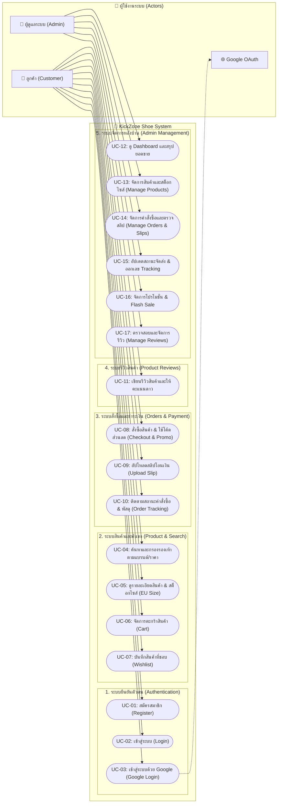
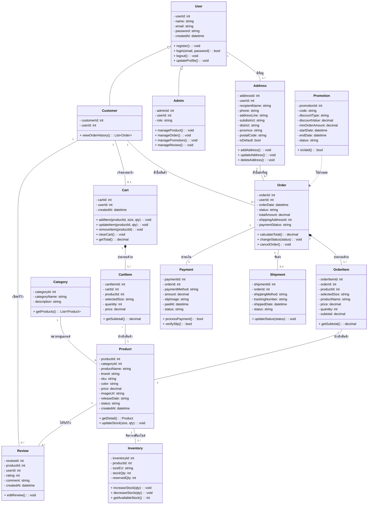
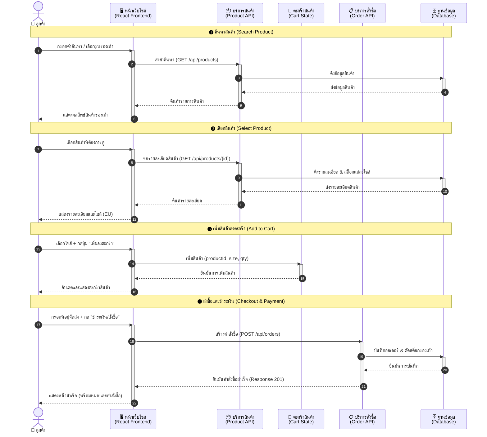

# เอกสารวิเคราะห์และออกแบบระบบ (Analysis & Design)
## โครงงาน: KickZone (คิ๊กโซน) - ระบบเว็บไซต์ร้านค้าออนไลน์สำหรับจัดจำหน่ายรองเท้า

---

## 📋 สารบัญ

- [การวิเคราะห์ความต้องการ](#การวิเคราะห์ความต้องการ)
- [แผนภาพยูสเคส](#แผนภาพยูสเคส)
- [โครงสร้างคลาส](#โครงสร้างคลาส)
- [แผนภาพลำดับการทำงาน](#แผนภาพลำดับการทำงาน)

---

## 1. การวิเคราะห์ความต้องการ (Requirements Analysis)

### 1.1 ความต้องการของผู้ใช้งาน (User Requirements)

ระบบมีผู้ใช้งานหลัก 2 กลุ่ม คือ ลูกค้า (Customer) และ ผู้ดูแลระบบ (Admin)

**ลูกค้า (Customer)**
* สมัครสมาชิก และเข้าสู่ระบบ (รองรับการเข้าสู่ระบบด้วยบัญชี Google)
* ค้นหา กรองช่วงราคา และเลือกดูสินค้ารองเท้าตามแบรนด์
* ดูรายละเอียดสินค้า โทนสี และตรวจสอบสต็อกแบบแยกตามไซส์ (EU Size)
* เพิ่มสินค้าลงตะกร้า (Shopping Cart) และบันทึกสินค้าที่ชอบ (Wishlist)
* ใช้งานโค้ดส่วนลด (Promo Code) และเข้าร่วมแคมเปญ Flash Sale
* ดำเนินการสั่งซื้อสินค้า (Checkout) พร้อมแนบหลักฐานการชำระเงิน (Upload Slip)
* ให้คะแนน (Rating) เขียนรีวิว และแนบรูปภาพสินค้าหลังการซื้อ
* ดูประวัติการสั่งซื้อ และติดตามสถานะพัสดุของตนเอง

**ผู้ดูแลระบบ (Admin)**
* ดูภาพรวมของระบบผ่าน Dashboard (สรุปยอดขาย, จำนวนคำสั่งซื้อ, จำนวนสินค้า)
* จัดการข้อมูลสินค้า (เพิ่ม/แก้ไข/ลบ ข้อมูลทั่วไป รูปภาพ และสต็อกสินค้าแยกตามไซส์)
* จัดการคำสั่งซื้อ (ตรวจสอบสลิปโอนเงิน, อัปเดตสถานะการจัดส่ง, และออกเลข Tracking อัตโนมัติ)
* จัดการโปรโมชั่น (สร้าง/แก้ไข/ลบ โค้ดส่วนลด, กำหนดสิทธิ์การใช้, และเปิดโหมด Flash Sale)
* จัดการรีวิว (ตรวจสอบข้อความ/รูปภาพ และลบรีวิวที่ไม่เหมาะสม)

### 1.2 ขอบเขตของระบบ (System Scope)

* 1.ระบบจัดการสมาชิกและการยืนยันตัวตน: ครอบคลุมการสมัครสมาชิก เข้าสู่ระบบ และการเชื่อมต่อผ่าน Google OAuth
* 2.ระบบจัดการข้อมูลสินค้าและคลังสินค้า: จัดการข้อมูลรองเท้าและระบบตัดสต็อกแบบเจาะจงตามไซส์ (EU Size)
* 3.ระบบค้นหาและแสดงผลสินค้า: ครอบคลุมการกรองสินค้าตามแบรนด์และราคา พร้อมแสดงรายละเอียดสินค้าที่ครบถ้วน
* 4.ระบบตะกร้าสินค้าและรายการที่ชอบ: การคำนวณราคาสินค้าในตะกร้า (Shopping Cart) และระบบ Wishlist
* 5.ระบบสั่งซื้อและโปรโมชั่น: การสร้างคำสั่งซื้อ การคำนวณส่วนลดจาก Promo Code และระบบ Flash Sale
* 6.ระบบการชำระเงิน: รองรับการยืนยันการสั่งซื้อผ่านการอัปโหลดหลักฐานการโอนเงิน (สลิปโอนเงิน)
* 7.ระบบติดตามคำสั่งซื้อ: การแสดงประวัติการสั่งซื้อและสถานะพัสดุสำหรับลูกค้า
* 8.ระบบรีวิวสินค้า: รองรับการให้คะแนนดาว เขียนความคิดเห็น และอัปโหลดรูปภาพรีวิวจากผู้ใช้งานจริง
* 9.ระบบจัดการหลังบ้าน (Admin Panel): แผงควบคุมสำหรับผู้ดูแลระบบในการจัดการคำสั่งซื้อ สินค้า โปรโมชั่น รีวิว และแสดงรายงานสรุปผล (Dashboard)

### 2. แผนภาพยูสเคส (Use Case Diagram)

---

### 3. โครงสร้างคลาส (Class Diagram)
ส่วนนี้แสดงโครงสร้างข้อมูล ความสัมพันธ์ระหว่าง Class (Relationships) และ Attributes/Methods ที่ใช้ในระบบจัดการร้านรองเท้ากีฬา

---

### 4. แผนภาพลำดับการทำงาน (Sequence Diagram)
ส่วนนี้แสดงลำดับขั้นตอนการสื่อสารและทำงานร่วมกันของระบบต่างๆ ตั้งแต่ผู้ใช้เรียกดูสินค้าจนถึงขั้นตอนการชำระเงินและส่งข้อมูลไปยังคลังสินค้า

---

🗄️ โครงสร้างข้อมูล (JSON Schema)
ระบบ KickZone Shoe ใช้โครงสร้างข้อมูล JSON สำหรับแลกเปลี่ยนข้อมูลระหว่าง Frontend (React) และ Backend (Express RESTful API) รวมถึงการบันทึกข้อมูลในฐานข้อมูล PostgreSQL (JSONB):

เอกสารฉบับเต็มของ JSON Schema สามารถดูได้ที่ [docs/json-schema.json](./docs/json-schema.json)

📌 สรุป Schema สำหรับ Entities หลัก:
#### 1. Product Schema (สินค้าและสต็อกตามไซส์)
{
  "$schema": "http://json-schema.org/draft-07/schema#",
  "title": "Product",
  "type": "object",
  "properties": {
    "id": { "type": "integer" },
    "name": { "type": "string" },
    "brand": { "type": "string" },
    "price": { "type": "number", "minimum": 0 },
    "image": { "type": "string" },
    "sku": { "type": "string" },
    "color": { "type": "string" },
    "releaseDate": { "type": "string" },
    "stock": {
      "type": "object",
      "additionalProperties": { "type": "integer", "minimum": 0 },
      "description": "สต็อกแยกตาม EU Size เช่น {'38': 10, '39': 5, '40': 0}"
    },
    "discountType": { "type": "string", "enum": ["fixed", "percentage"] },
    "discountValue": { "type": "number", "default": 0 },
    "promotionTag": { "type": "string" }
  },
  "required": ["name", "price", "stock"]
}
#### 2. Order Schema (คำสั่งซื้อและสลิปการโอน)
{
  "$schema": "http://json-schema.org/draft-07/schema#",
  "title": "Order",
  "type": "object",
  "properties": {
    "id": { "type": "string", "description": "รหัสคำสั่งซื้อ เช่น ORD-1721689200000-123" },
    "customerName": { "type": "string" },
    "customerEmail": { "type": "string", "format": "email" },
    "shoeModel": { "type": "string" },
    "size": { "type": "string" },
    "totalAmount": { "type": "number", "minimum": 0 },
    "paymentMethod": { "type": "string", "default": "PromptPay" },
    "paymentStatus": { "type": "string", "enum": ["Pending Upload", "Paid", "Rejected", "Refunded"] },
    "orderStatus": { "type": "string", "enum": ["Processing", "Shipping", "Completed", "Cancelled"] },
    "trackingNumber": { "type": "string", "default": "N/A" },
    "slipUrl": { "type": ["string", "null"] },
    "createdAt": { "type": "string", "format": "date-time" }
  },
  "required": ["id", "customerName", "customerEmail", "shoeModel", "size", "totalAmount"]
}

#### 3. Promotion Schema (โปรโมชั่นและ Flash Sale)
{
  "$schema": "http://json-schema.org/draft-07/schema#",
  "title": "Promotion",
  "type": "object",
  "properties": {
    "id": { "type": "integer" },
    "code": { "type": "string" },
    "description": { "type": "string" },
    "discountType": { "type": "string", "enum": ["percentage", "fixed"] },
    "discountValue": { "type": "number" },
    "maxDiscount": { "type": ["number", "null"] },
    "maxUses": { "type": ["integer", "null"] },
    "currentUses": { "type": "integer", "default": 0 },
    "isFlashSale": { "type": "boolean", "default": false },
    "isActive": { "type": "boolean", "default": true }
  },
  "required": ["code", "discountType", "discountValue"]
}

---
**ดู:** [System Architecture →](architecture.md)
