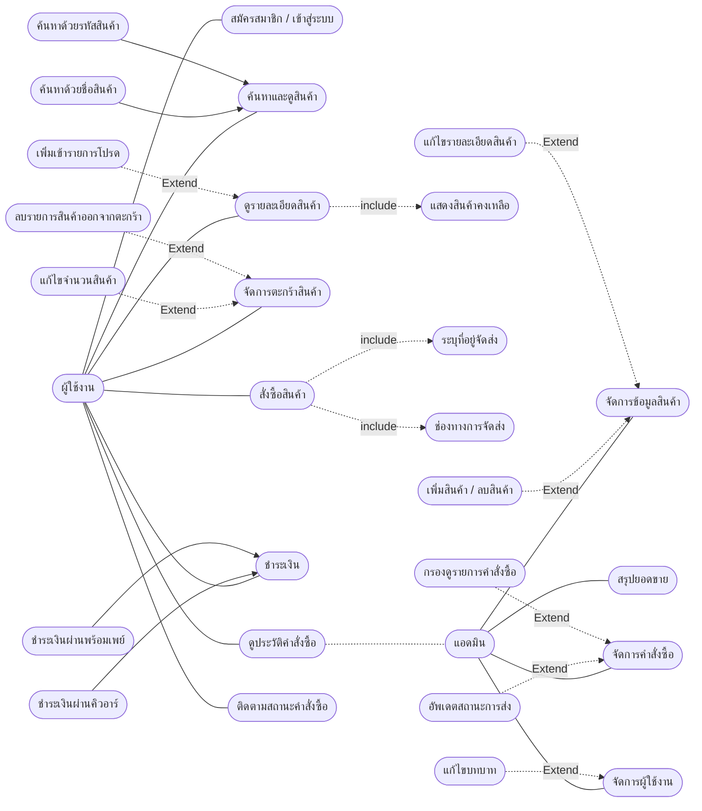

# เอกสารวิเคราะห์และออกแบบระบบ (Analysis & Design)
## โครงงาน: KickZone (คิ๊กโซน) - ระบบเว็บไซต์ร้านค้าออนไลน์สำหรับจัดจำหน่ายรองเท้า

---

## 📋 สารบัญ

- [การวิเคราะห์ความต้องการ](#การวิเคราะห์ความต้องการ)
- [แผนภาพยูสเคส](#แผนภาพยูสเคส)
- [เทคโนโลยี (Tech Stack)](#เทคโนโลยี)
- [เอกสารประกอบโครงงาน](#เอกสารประกอบโครงงาน)

---

## 1. การวิเคราะห์ความต้องการ (Requirements Analysis)

### 1.1 ความต้องการของผู้ใช้งาน (User Requirements)

ระบบมีผู้ใช้งานหลัก 2 กลุ่ม คือ ลูกค้า (Customer) และ ผู้ดูแลระบบ (Admin)

**ลูกค้า (Customer)**
* สมัครสมาชิก / เข้าสู่ระบบ
* ค้นหาและเลือกซื้อสินค้ารองเท้า
* เพิ่มสินค้าลงตะกร้า (Cart)
* สั่งซื้อสินค้า (Checkout)
* ดูประวัติการสั่งซื้อ

**ผู้ดูแลระบบ (Admin)**
* จัดการข้อมูลสินค้า (เพิ่ม/แก้ไข/ลบ)
* จัดการหมวดหมู่/แบรนด์สินค้า
* ดูรายงานยอดขายและคำสั่งซื้อ
* จัดการผู้ใช้งานในระบบ

### 1.2 ขอบเขตของระบบ (System Scope)

ระบบครอบคลุมฟังก์ชันหลัก 9 ส่วน ตามที่กำหนดในรายวิชา ได้แก่

1. การจัดการสมาชิก (Register / Login)
2. การจัดการข้อมูลสินค้า
3. การค้นหาและแสดงรายละเอียดสินค้า
4. ระบบตะกร้าสินค้า (Shopping Cart)
5. ระบบสั่งซื้อสินค้า (Order Management)
6. ระบบชำระเงิน (Simulation)
7. ระบบติดตามสถานะคำสั่งซื้อ
8. ระบบจัดการสินค้าและคำสั่งซื้อสำหรับผู้ดูแลระบบ
9. รายงาน / Dashboard สรุปข้อมูล

### 2. แผนภาพยูสเคส (Use Case Diagram)

**Mermaid Diagram:**
