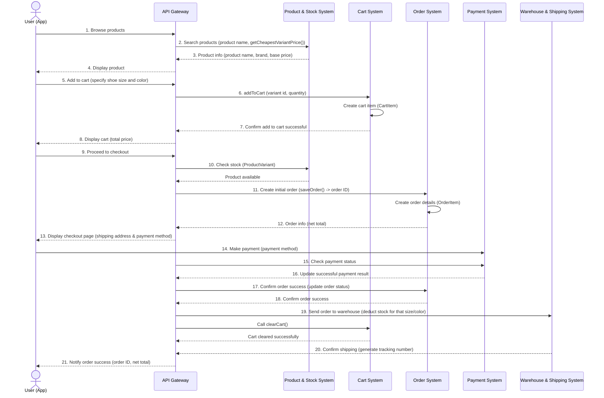

# เอกสารวิเคราะห์และออกแบบระบบ (Analysis & Design)
## โครงงาน: KickZone (คิ๊กโซน) - ระบบเว็บไซต์ร้านค้าออนไลน์สำหรับจัดจำหน่ายรองเท้า

---

## 📋 สารบัญ

- [การวิเคราะห์ความต้องการ](#การวิเคราะห์ความต้องการ)
- [แผนภาพยูสเคส](#แผนภาพยูสเคส)
- [โครงสร้างคลาส](#โครงสร้างคลาส)
- [แผนภาพลำดับการทำงาน](#แผนภาพลำดับการทำงาน)

---

## 1. การวิเคราะห์ความต้องการ (Requirements Analysis)

### 1.1 ความต้องการของผู้ใช้งาน (User Requirements)

ระบบมีผู้ใช้งานหลัก 2 กลุ่ม คือ ลูกค้า (Customer) และ ผู้ดูแลระบบ (Admin)

**ลูกค้า (Customer)**
* สมัครสมาชิก / เข้าสู่ระบบ
* ค้นหาและเลือกซื้อสินค้ารองเท้า
* เพิ่มสินค้าลงตะกร้า (Cart)
* สั่งซื้อสินค้า (Checkout)
* ดูประวัติการสั่งซื้อ

**ผู้ดูแลระบบ (Admin)**
* จัดการข้อมูลสินค้า (เพิ่ม/แก้ไข/ลบ)
* จัดการหมวดหมู่/แบรนด์สินค้า
* ดูรายงานยอดขายและคำสั่งซื้อ
* จัดการผู้ใช้งานในระบบ

### 1.2 ขอบเขตของระบบ (System Scope)

ระบบครอบคลุมฟังก์ชันหลัก 9 ส่วน ตามที่กำหนดในรายวิชา ได้แก่

1. การจัดการสมาชิก (Register / Login)
2. การจัดการข้อมูลสินค้า
3. การค้นหาและแสดงรายละเอียดสินค้า
4. ระบบตะกร้าสินค้า (Shopping Cart)
5. ระบบสั่งซื้อสินค้า (Order Management)
6. ระบบชำระเงิน (Simulation)
7. ระบบติดตามสถานะคำสั่งซื้อ
8. ระบบจัดการสินค้าและคำสั่งซื้อสำหรับผู้ดูแลระบบ
9. รายงาน / Dashboard สรุปข้อมูล

### 2. แผนภาพยูสเคส (Use Case Diagram)

---

### 3. โครงสร้างคลาส (Class Diagram)
ส่วนนี้แสดงโครงสร้างข้อมูล ความสัมพันธ์ระหว่าง Class (Relationships) และ Attributes/Methods ที่ใช้ในระบบจัดการร้านรองเท้ากีฬา

classDiagram
    direction TB

    %% ==========================================
    %% 1. User & Identity Layer
    %% ==========================================
    class User {
        - userId: int
        - name: string
        - email: string
        - password: string
        - createdAt: datetime
        + register(): void
        + login(email, password): bool
        + logout(): void
        + updateProfile(): void
    }

    class Customer {
        - customerId: int
        - userId: int
        + viewOrderHistory(): List~Order~
    }

    class Admin {
        - adminId: int
        - userId: int
        - role: string
        + manageProduct(): void
        + manageOrder(): void
        + managePromotion(): void
        + manageReview(): void
    }

    class Address {
        - addressId: int
        - userId: int
        - recipientName: string
        - phone: string
        - addressLine: string
        - subdistrict: string
        - district: string
        - province: string
        - postalCode: string
        - isDefault: bool
        + addAddress(): void
        + updateAddress(): void
        + deleteAddress(): void
    }

    %% User Relationships
    User <|-- Customer
    User <|-- Admin
    User "1" -- "1..*" Address : มีที่อยู่

    %% ==========================================
    %% 2. Product & Catalog Layer
    %% ==========================================
    class Category {
        - categoryId: int
        - categoryName: string
        - description: string
        + getProducts(): List~Product~
    }

    class Product {
        - productId: int
        - categoryId: int
        - productName: string
        - brand: string
        - sku: string
        - color: string
        - price: decimal
        - imageUrl: string
        - releaseDate: string
        - status: string
        - createdAt: datetime
        + getDetail(): Product
        + updateStock(size, qty): void
    }

    class Inventory {
        - inventoryId: int
        - productId: int
        - sizeEU: string
        - stockQty: int
        - reservedQty: int
        + increaseStock(qty): void
        + decreaseStock(qty): void
        + getAvailableStock(): int
    }

    %% Product Relationships
    Category "1" -- "0..*" Product : หมวดหมู่แบรนด์
    Product "1" -- "1..*" Inventory : จัดการสต็อกไซส์

    %% ==========================================
    %% 3. Cart & Shopping Layer
    %% ==========================================
    class Cart {
        - cartId: int
        - userId: int
        - createdAt: datetime
        + addItem(productId, size, qty): void
        + updateItem(productId, qty): void
        + removeItem(productId): void
        + clearCart(): void
        + getTotal(): decimal
    }

    class CartItem {
        - cartItemId: int
        - cartId: int
        - productId: int
        - selectedSize: string
        - quantity: int
        - price: decimal
        + getSubtotal(): decimal
    }

    %% Cart Relationships
    Customer "1" -- "0..1" Cart : เจ้าของตะกร้า
    Cart "1" *-- "1..*" CartItem : ประกอบด้วย
    CartItem "*" -- "1" Product : อ้างอิงสินค้า

    %% ==========================================
    %% 4. Order & Transaction Layer
    %% ==========================================
    class Order {
        - orderId: int
        - userId: int
        - orderDate: datetime
        - status: string
        - totalAmount: decimal
        - shippingAddressId: int
        - paymentStatus: string
        + calculateTotal(): decimal
        + changeStatus(status): void
        + cancelOrder(): void
    }

    class OrderItem {
        - orderItemId: int
        - orderId: int
        - productId: int
        - selectedSize: string
        - productName: string
        - price: decimal
        - quantity: int
        - subtotal: decimal
        + getSubtotal(): decimal
    }

    %% Order Relationships
    Customer "1" -- "0..*" Order : สั่งซื้อสินค้า
    Address "1" -- "0..*" Order : สั่งซื้อส่งที่อยู่
    Order "1" *-- "1..*" OrderItem : ประกอบด้วย
    OrderItem "*" -- "1" Product : อ้างอิงสินค้า

    %% ==========================================
    %% 5. Fulfillment, Promotion & Feedback
    %% ==========================================
    class Payment {
        - paymentId: int
        - orderId: int
        - paymentMethod: string
        - amount: decimal
        - slipImage: string
        - paidAt: datetime
        - status: string
        + processPayment(): bool
        + verifySlip(): bool
    }

    class Shipment {
        - shipmentId: int
        - orderId: int
        - shippingMethod: string
        - trackingNumber: string
        - shippedDate: datetime
        - status: string
        + updateStatus(status): void
    }

    class Promotion {
        - promotionId: int
        - code: string
        - discountType: string
        - discountValue: decimal
        - minOrderAmount: decimal
        - startDate: datetime
        - endDate: datetime
        - status: string
        + isValid(): bool
    }

    class Review {
        - reviewId: int
        - productId: int
        - userId: int
        - rating: int
        - comment: string
        - createdAt: datetime
        + editReview(): void
    }

    %% Service & Review Relationships
    Order "1" -- "1" Payment : ชำระเงิน
    Order "1" -- "0..1" Shipment : จัดส่ง
    Promotion ..> Order : ใช้ส่วนลด
    Customer "1" -- "0..*" Review : เขียนรีวิว
    Product "1" -- "0..*" Review : ได้รับรีวิว

---

### 4. แผนภาพลำดับการทำงาน (Sequence Diagram)
ส่วนนี้แสดงลำดับขั้นตอนการสื่อสารและทำงานร่วมกันของระบบต่างๆ ตั้งแต่ผู้ใช้เรียกดูสินค้าจนถึงขั้นตอนการชำระเงินและส่งข้อมูลไปยังคลังสินค้า

---

**ดู:** [System Architecture →](architecture.md)